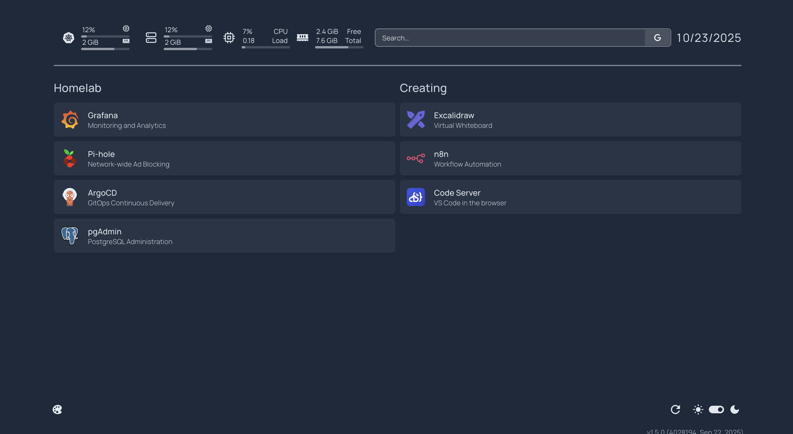

# Kubernetes Homelab

This repository contains the configuration for a personal homelab environment, managed using a GitOps approach with Kubernetes and ArgoCD.

## Repository Structure

The repository is structured to support an "Appset-of-Appset pattern with ArgoCD, allowing for a declarative and version-controlled setup.

-   `bootstrap/`: This directory contains the root ArgoCD ApplicationSet, which is the entry point for deploying all other applications.
-   `addons/`: This directory contains the ArgoCD ApplicationSets for various applications, categorized into `cluster-services` and `user-applications`.
-   `environments/`: This directory holds the specific Kubernetes manifests and configurations for each application, organized by environment (e.g., `default`).

## Applications

This homelab includes the following applications:

### User Applications

-   **Code Server:** A VS Code instance running in the browser.
-   **Excalidraw:** A virtual collaborative whiteboard.
-   **Homepage:** A customizable homepage for your homelab services.
-   **n8n:** A workflow automation tool.
-   **pgAdmin:** A web-based administration tool for PostgreSQL.
  
### View of the Homepage.dev dashboard


## Configuration

Before deploying this homelab, you **MUST** replace all placeholder values marked as `"Change Me"` with your actual configuration values. The deployment will fail without these changes.

### Prerequisites

- Kubernetes cluster with ArgoCD installed
- Domain name or local DNS setup
- Load balancer or ingress controller (e.g., Traefik, NGINX)

### Required Configuration Changes

#### 1. Domain Configuration

**Search and replace ALL instances of `"Change Me"` with your domain:**

| Application | File | Setting | Example Value |
|-------------|------|---------|---------------|
| **pgAdmin** | `environments/default/addons/pgadmin/manifest.yaml` | Ingress host | `pgadmin.yourdomain.com` |
| **Code Server** | `environments/default/addons/code-server/manifest.yaml` | Ingress host | `code.yourdomain.com` |
| **Excalidraw** | `environments/default/addons/excalidraw/manifest.yaml` | Ingress host | `excalidraw.yourdomain.com` |
| **n8n** | `environments/default/addons/n8n/ingress.yaml` | Ingress host | `n8n.yourdomain.com` |
| **Grafana** | `environments/default/addons/kube-prometheus-stack/values.yaml` | Ingress host | `grafana.yourdomain.com` |
| **Homepage** | `environments/default/addons/homepage/manifest.yaml` | Multiple locations | `homepage.yourdomain.com` |
| **Pi-hole** | `environments/default/addons/pihole/values.yaml` | Multiple locations | `pihole.yourdomain.com` |

#### 2. Network Configuration

**Pi-hole Load Balancer IP:**
- **File:** `environments/default/addons/pihole/values.yaml`
- **Setting:** `serviceDns.loadBalancerIP`
- **Change:** `"Change Me"` → Your available IP (e.g., `192.168.1.100`)
- **Setting:** `dnsmasq.customDnsEntries`
- **Change:** `address=/Change Me/Change Me` → `address=/.yourdomain.com/192.168.1.100`

#### 3. Application Credentials

**pgAdmin:**
- **File:** `environments/default/addons/pgadmin/manifest.yaml`
- **Setting:** `PGADMIN_DEFAULT_EMAIL`
- **Change:** `"Change Me"` → Your email address

**Code Server:**
- **File:** `environments/default/addons/code-server/manifest.yaml`
- **Setting:** `PASSWORD`
- **Change:** `"Change Me"` → Your secure password

**Homepage:**
- **File:** `environments/default/addons/homepage/manifest.yaml`
- **Setting:** `HOMEPAGE_VAR_PIHOLE_KEY`
- **Change:** `"Change Me"` → Your Pi-hole API key (get from Pi-hole admin panel)
- **Setting:** All service URLs in ConfigMap
- **Change:** Replace all `Change Me` with your actual service domains

### Verification

Before deployment, verify no `"Change Me"` placeholders remain:

```bash
grep -r "Change Me" environments/
```

This command should return no results if all placeholders have been replaced.

### Cluster Services

-   **Kube Prometheus Stack:** Provides a comprehensive monitoring solution for the Kubernetes cluster using Prometheus and Grafana.
-   **Pi-hole:** A network-wide ad blocker.

## Deployment

This repository is managed by ArgoCD and follows the "app of apps" pattern. To deploy the entire homelab setup, you need a running Kubernetes cluster with ArgoCD installed.

1.  **Bootstrap the environment:**

    Apply the root ApplicationSet to your cluster. This will instruct ArgoCD to deploy all the applications defined in this repository.

    ```bash
    kubectl apply -f bootstrap/root-appset.yaml
    ```

2.  **Enable Applications:**

    Each application is controlled by a label selector in its ApplicationSet (e.g., `enable_n8n: 'true'`). To deploy an application, you need to add the corresponding label to your Kubernetes cluster in ArgoCD.

Once the root ApplicationSet is applied, ArgoCD will automatically sync the applications and deploy them to the cluster.